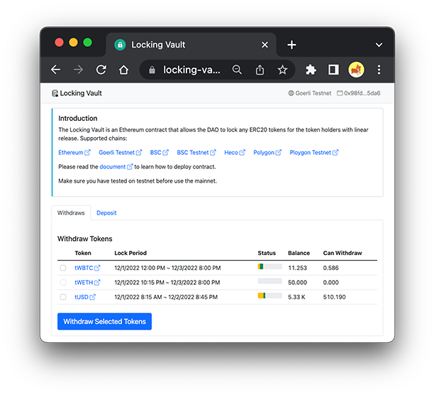
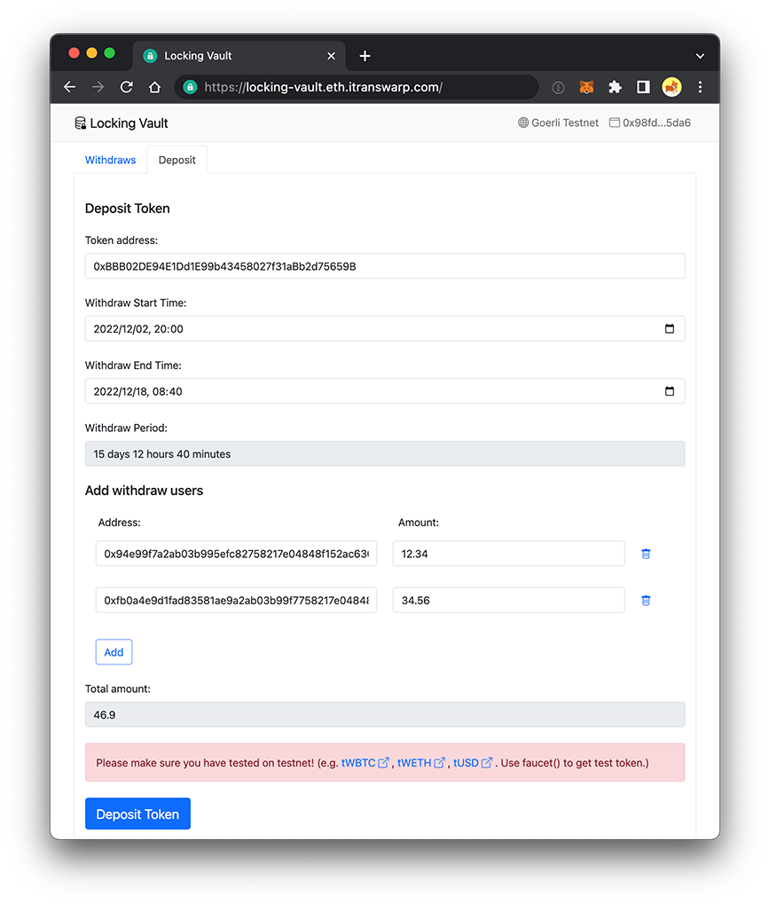

# Locking Vault

The Locking Vault is an Ethereum contract that allows the DAO to lock any ERC20 tokens for the token holders with linear release.

Start: https://locking-vault.eth.itranswarp.com

# Screenshot

